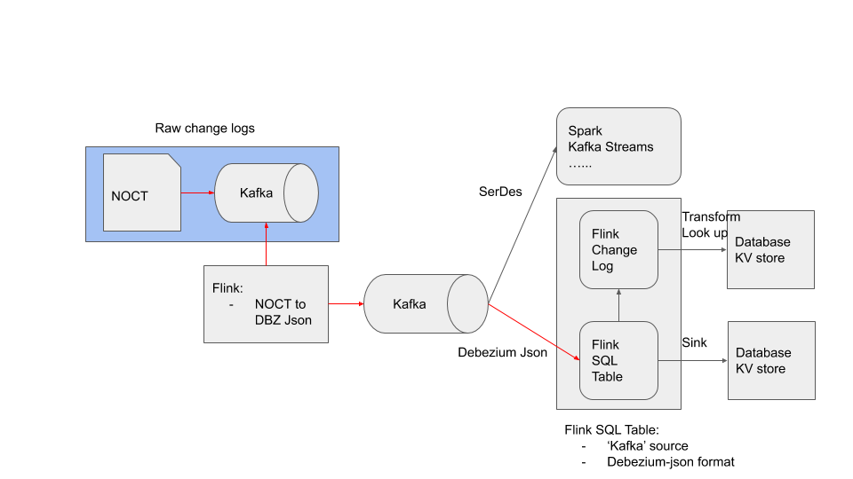

# Flink CDC Demo

https://docs.google.com/presentation/d/1JrZ2ssEGxEaZT0muFJjMAH7aC3YIf1xQn4e5VZcd8z4/edit?usp=sharing

Prerequisites:
- Minikube
- kubectl
- Helm
- Apache Kafka
- kafkacat
- Apache Flink
- MySQL

```
$ minikube start --cpus=2 --memory=6g --kubernetes-version=v1.17.12

# MariaDB
$ helm install mariadb stable/mariadb ---set rootUser.password=mypassword --set replication.enabled=false

# MariaDB(MySQL) client
$ kubectl run mariadb-client --rm --tty -i --restart='Never' --image  docker.io/bitnami/mariadb:10.3.22-debian-10-r27 --namespace default --command -- bash
> mysql -h mariadb.default.svc.cluster.local -uroot -p

> CREATE DATABASE test;
> CREATE TABLE customer ( 
    c_customer_sk bigint,          
    c_customer_id char(16),        
    c_current_cdemo_sk bigint,     
    c_current_hdemo_sk bigint,     
    c_current_addr_sk bigint,      
    c_first_shipto_date_sk bigint, 
    c_first_sales_date_sk bigint,  
    c_salutation char(10),         
    c_first_name char(20),         
    c_last_name char(30),
    CONSTRAINT pk PRIMARY KEY (c_customer_sk)         
 );

# Kafka operator
$ helm install strimzi-kafka-operator strimzi/strimzi-kafka-operator
$ kubectl apply -f kafka-persistent-single.yaml

# Flink
$ helm upgrade --install flink-operator ./flink-on-k8s-operator/helm-chart/flink-operator/ --set operatorImage.name="gcr.io/flink-operator/flink-operator:latest"


```

## Dataflow



## Source table

Database: test

Table: customer

```
> describe tpcds.sf1.customer;
         Column         |    Type     | Extra | Comment 
------------------------+-------------+-------+---------
 c_customer_sk          | bigint      |       |         
 c_customer_id          | char(16)    |       |         
 c_current_cdemo_sk     | bigint      |       |         
 c_current_hdemo_sk     | bigint      |       |         
 c_current_addr_sk      | bigint      |       |         
 c_first_shipto_date_sk | bigint      |       |         
 c_first_sales_date_sk  | bigint      |       |         
 c_salutation           | char(10)    |       |         
 c_first_name           | char(20)    |       |         
 c_last_name            | char(30)    |       |         

> select count(*) from tpcds.sf1.customer;
 _col0  
--------
 100000 

```

DDL:
```
 CREATE TABLE customer ( 
    c_customer_sk bigint,          
    c_customer_id char(16),        
    c_current_cdemo_sk bigint,     
    c_current_hdemo_sk bigint,     
    c_current_addr_sk bigint,      
    c_first_shipto_date_sk bigint, 
    c_first_sales_date_sk bigint,  
    c_salutation char(10),         
    c_first_name char(20),         
    c_last_name char(30),
    CONSTRAINT pk PRIMARY KEY (c_customer_sk)         
 )         

```

## Snapshot(Initial) data for customer table

```
TBD
```

## NOCT

Change logs for demo:
```
IA,100001,AAAAAAAABAAAAAAA,980124,7135,32946,2452238,2452208,Mr.       ,Javier              ,Lewis                         
IA,100002,AAAAAAAACAAAAAAA,819667,1461,31655,2452318,2452288,Dr.       ,Amy                 ,Moses                         
UA,1,AAAAAAAADAAAAAAA,1473522,6247,48572,2449130,2449100,Miss      ,KIM             ,KIM                      
DB,4,AAAAAAAAEAAAAAAA,1703214,3986,39558,2450030,2450000,Dr.       ,Michael             ,White                         
DB,5,AAAAAAAAFAAAAAAA,953372,4470,36368,2449438,2449408,Sir       ,Robert              ,Moran 
```

## Kafka Topics

```
$ kubectl apply -f test-customer-changelog-raw.yaml
$ kubectl apply -f test-customer-changelog-bdz.yaml

```

NOCT RAW:
  - ```test-customer-changelog-raw``` topic

Publish logs to kafka topic:
```
$ kubectl run kafka-producer -ti --image=strimzi/kafka:latest-kafka-2.5.0 --rm=true --restart=Never -- bin/kafka-console-producer.sh \
--broker-list my-cluster-kafka-bootstrap:9092 --topic test-customer-changelog-raw

```
DBZ Json:
  - test-customer-changelog-dbz

## Running Demo App.

Build the docker image:
```
$ docker build -t youngwookim/flink-cdc:0.1.0 . && docker push youngwookim/flink-cdc:0.1.0

```

Flink job cluster:
```
$ kubectl apply -f flinkcluster-cdc-noct.yaml
$ kubectl logs job.batch/flinkjobcluster-cdc-noct-job
```

```
$ kubectl apply -f flinkcluster-cdc-dbz.yaml
$ kubectl logs job.batch/flinkjobcluster-cdc-dbz-job
```

### NOCT to DBZ Json

Load initial (snapshot) change logs to Kafka topic:
```
-- find the pod 
$ kubectl get pod | grep noct | grep jobmanager

-- shell
$ kubectl exec --stdin --tty flinkjobcluster-cdc-noct-jobmanager-5db8c9fbdf-tx2kj -- /bin/bash

-- Publish snapshot
# cat /opt/customer_SNAPSHOT_NOCT.csv | kafkacat -b my-cluster-kafka-bootstrap:9092 -t test-customer-changelog-raw -P

```

Subscribe ```test-customer-changelog-dbz``` events:
```
$ kubectl run kafka-consumer -ti --image=strimzi/kafka:latest-kafka-2.5.0 --rm=true --restart=Never -- bin/kafka-console-consumer.sh \
  --bootstrap-server my-cluster-kafka-bootstrap:9092 --topic test-customer-changelog-dbz --from-beginning

```

### Change logs to Flink Table & Sink Connector (JDBC)

Target table (MariaDB):
```
$ kubectl run mariadb-client --rm --tty -i --restart='Never' --image  docker.io/bitnami/mariadb:10.3.22-debian-10-r27 --namespace default --command -- bash
> mysql -h mariadb.default.svc.cluster.local -uroot -p

```

```
> SELECT count(*) from test.customer;

```
